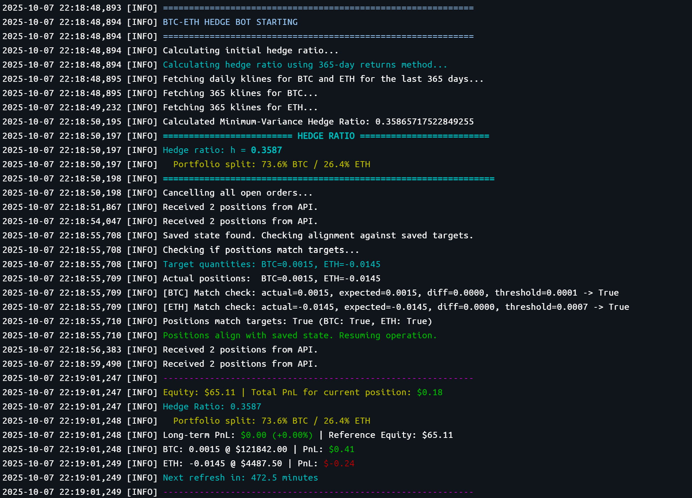

# 🤖 Pacifica BTC-ETH Hedge Bot

This is a trading bot for the Pacifica DEX that implements a pseudo delta-neutral (market-neutral) long/short strategy on BTC-PERP and ETH-PERP. It aims to generate returns from the basis between the two assets while remaining hedged against overall market movements.

The bot is data-driven, using historical price data to calculate a hedge ratio that determines the relative sizes of the long BTC and short ETH positions.

If you would like to support this work, please use one of the following referral codes when registering on [Pacifica DEX](https://app.pacifica.fi/) (if one is already taken, try the other ones):

- `BYVJRCM791XFCF5K`
- `ENPVKJ1WAVYNV2Z0`
- `6HR2WM4C0JQ7D39Q`
- `411J9J7CYNFZN3SX`
- `2K7D40A9H53M2TJT`
- `S1G3A2063Q7410BV`
- `XH2V3VY9CQ7535CX`
- `EK8NXX12VDKJJWNK`
- `6NBS6TT7Y1SV2P53`
- `E5ZYTD2FVXJA123W`

## ✨ Features

- **📈 Pseudo Delta-Neutral Strategy**: Goes long on BTC and short on ETH to hedge against directional market risk. While it aims to minimize directional risk, it's important to note that this is not a perfect delta-neutral hedge.
- **📊 Data-Driven Hedge Ratio**: Automatically calculates a minimum-variance hedge ratio based on the last 365 days of daily returns to determine position sizes.
- **💾 State Management**: Saves the bot's state (open positions, hedge ratio, etc.) to a `state.json` file, allowing it to resume operations after a restart.
- **🧠 Intelligent Reconciliation**: At startup, the bot checks if its saved state is consistent with the positions on the exchange and makes adjustments if necessary.
- **🛡️ Stop-Loss Protection**: Includes a configurable stop-loss to protect against excessive losses on either leg of the pair.
- **🔌 Safe Shutdown**: Designed to leave positions open when interrupted (e.g., with Ctrl+C) to prevent unintended closing of positions.

## Screenshot



## 🚀 Getting Started

### Prerequisites

- Python 3.8+
- An account on the Pacifica DEX: https://app.pacifica.fi/
- API keys for your Pacifica account

### Installation

1.  **Clone the repository:**
    ```bash
    git clone <repository_url>
    cd hedge_bot
    ```

2.  **Install the required packages:**
    ```bash
    pip install -r requirements.txt
    ```

### Configuration

1.  **Create a `.env` file** in the root of the project and add your API keys and wallet address. You can copy the `.env.example` file to get started:
    ```bash
    cp .env.example .env
    ```
    Then, edit the `.env` file with your credentials.

2.  **Edit the `config.json` file** to configure the bot's parameters:
    - `capital_pct`: The percentage of your account equity to use for the strategy.
    - `leverage`: The leverage to use for your positions.
    - `refresh_hours`: The number of hours between position refreshes.
    - `stoploss_pct`: The stop-loss percentage for each leg of the pair.
    - `slippage_bps`: The allowed slippage in basis points for market orders.
    - `loop_sleep_seconds`: The time in seconds the bot waits between checks in the main loop.
    - `status_interval_seconds`: The frequency in seconds of the status log output.

## ▶️ Usage

To run the bot, simply execute the `main.py` script:

```bash
python main.py
```

The bot will start, cancel any existing open orders, and then either open a new pair of positions or reconcile existing ones. It will then run continuously, checking for stop-loss conditions and refreshing the positions at the configured interval.

## 🐳 Running with Docker

Alternatively, you can run the bot in a Docker container using the provided `docker-compose.yml` file. This is a convenient way to run the bot in a controlled environment.

1.  **Build the Docker image:**
    ```bash
    docker-compose build
    ```

2.  **Run the bot in detached mode:**
    ```bash
    docker-compose up -d
    ```

To view the bot's logs, you can use the following command:
```bash
docker-compose logs -f
```

## 🧪 Testing

The project includes a suite of tests to verify the core logic. To run the tests, use the `run_tests.py` script:

```bash
python run_tests.py
```